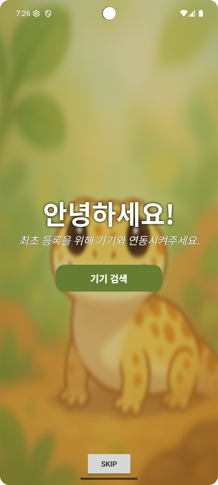
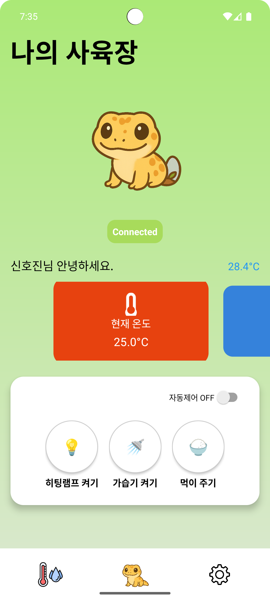

# AppProject

 

### 작품제목
- 스마트 파충류 케이지 애플리케이션
---
 

### 작품설명
- 스마트 파충류 케이지 애플리케이션으로 **라즈베리 파이**와 연동하여 휴대폰으로 쉽게 케이지의 상태를 점검하고, 온도 및 습도 그리고 먹이 주기를 설정할 수 있다.
---
 

### 작품사진

  
  

---

 

### 개발과정
|날짜|한 일|완료여부|
|---|---|---|
|0422|앱 기초 틀 제작, 메인 화면 제작 | ✅ |  
|0429|메인 화면 UI 수정, 설정 화면 제작, 이 외 피드백 적용 수정|✅|
|0506|로그 화면 제작, 블루투스 페어링 화면 제작, 이 외 피드백 적용 수정|✅|
|0513|로그 화면 UI 수정, 블루투스 페어링 화면 UI 수정, 이 외 피드백 적용 수정|✅|
|0520||❌|
